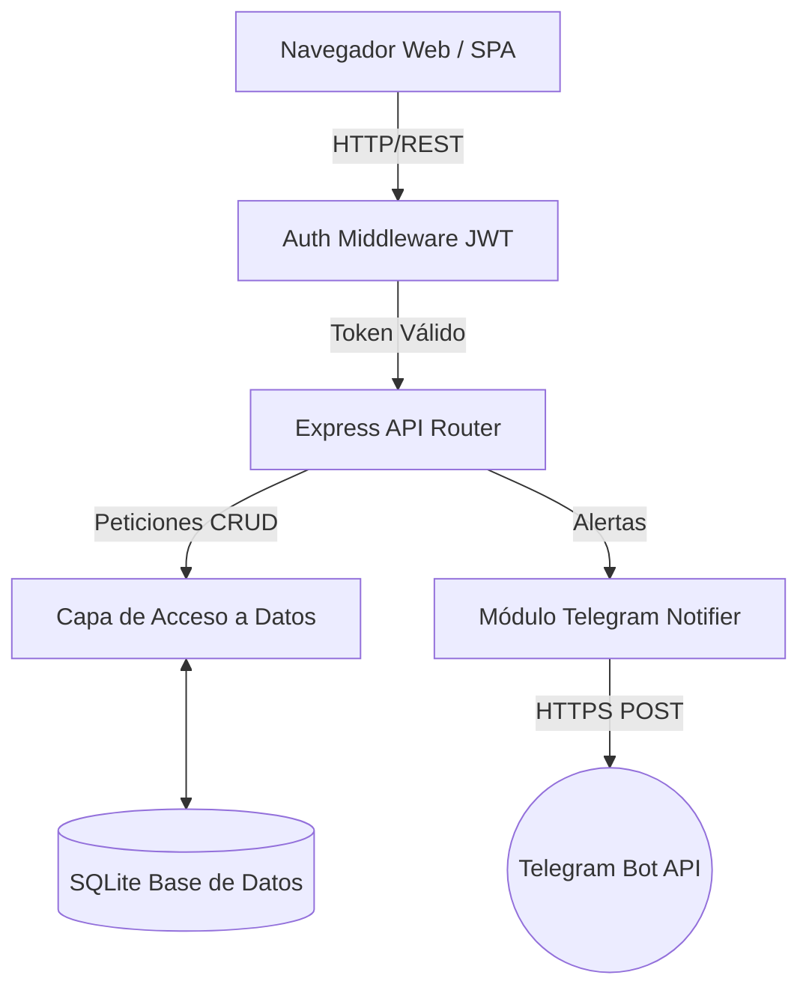

# 07. Arquitectura del Sistema

La aplicación sigue una **Arquitectura Cliente-Servidor** utilizando un patrón **Monolito Ligero**. El backend no solo expone una API REST, sino que también sirve los archivos estáticos de la Single Page Application (SPA).

## Diagrama de Componentes

## Capas del Sistema

1. **Capa de Presentación (Frontend):**
   - Construida completamente en HTML5, CSS3 y JavaScript puro (Vanilla).
   - Patrón SPA con enrutamiento basado en manipulación del DOM (clases `.hidden`).
   - Comunicación con el servidor exclusivamente a través del módulo genérico `api.js` (Fetch API).

2. **Capa de Lógica de Negocio (Backend / Express):**
   - Node.js actuando como servidor web y API REST.
   - Seguridad: Middleware `auth.js` verifica la validez y los claims del JWT en cada petición.
   - Orquestador de eventos: Generación de alertas a Telegram cuando detecta niveles de stock críticos.

3. **Capa de Persistencia (Base de Datos):**
   - Motor SQLite embebido mediante la librería `better-sqlite3`.
   - Elegido por su velocidad en lecturas síncronas, nula necesidad de configuración y excelente ajuste para cargas de trabajo de PYMES.
